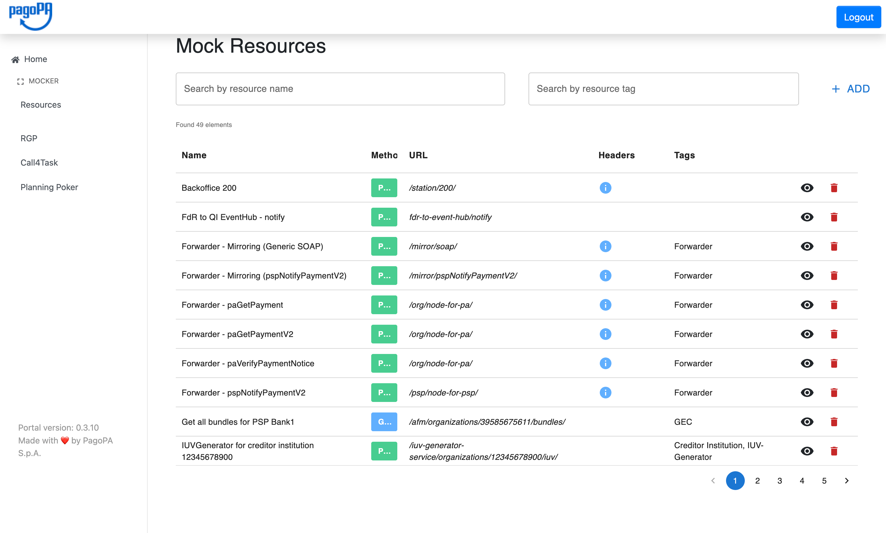
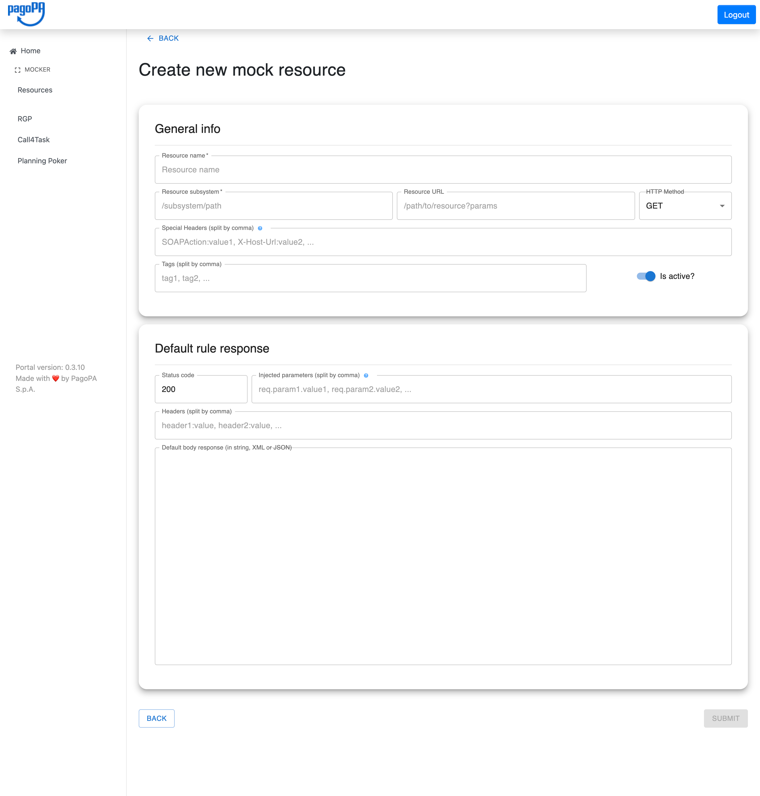
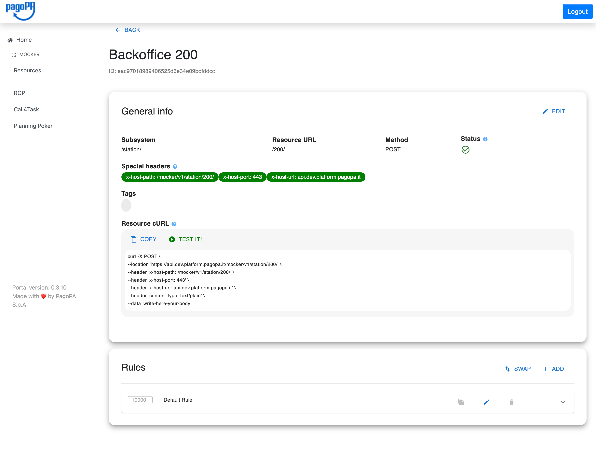

# Guida Operativa — Mocker (Shared Toolbox)

Guida all'uso dell'interfaccia web del **pagoPA Shared Toolbox** per la gestione delle mock resources.

> Per la documentazione delle API REST sottostanti, vedere la [Guida Operativa di pagopa-mocker-config](https://github.com/pagopa/pagopa-mocker-config/blob/docs/guida-operativa/GUIDA_OPERATIVA.md).
>
> Per la documentazione del runtime engine, vedere la [Guida Operativa di pagopa-mocker](https://github.com/pagopa/pagopa-mocker/blob/docs/guida-operativa/GUIDA_OPERATIVA.md).

## Indice

1. [Accesso all'interfaccia](#accesso-allinterfaccia)
2. [Lista delle Mock Resources](#lista-delle-mock-resources)
3. [Creazione di una Mock Resource](#creazione-di-una-mock-resource)
4. [Dettaglio di una Mock Resource](#dettaglio-di-una-mock-resource)
5. [Gestione delle Regole](#gestione-delle-regole)
6. [Simulatore](#simulatore)

---

## Accesso all'interfaccia

Il portale è disponibile su:

- **DEV:** `https://shared.dev.platform.pagopa.it/ui`
- **UAT:** `https://shared.uat.platform.pagopa.it/ui`

L'autenticazione avviene tramite **Azure AD**. Dopo il login, selezionare **MOCKER → Resources** dalla barra laterale sinistra.

---

## Lista delle Mock Resources



La pagina principale mostra tutte le mock resource configurate con:

| Colonna | Descrizione |
|---|---|
| **Name** | Nome descrittivo della risorsa |
| **Method** | Metodo HTTP (badge verde = POST, blu = GET, ecc.) |
| **URL** | Path della risorsa (subsystem + resource URL) |
| **Headers** | Icona info se sono presenti special headers |
| **Tags** | Etichette per categorizzare la risorsa |

**Funzionalità disponibili:**
- **Search by resource name** — filtra per nome (ricerca parziale)
- **Search by resource tag** — filtra per tag
- **+ ADD** — apre il form di creazione di una nuova risorsa
- Paginazione in fondo alla tabella (49 elementi nell'esempio, 5 pagine)
- **Occhio** — apre il dettaglio della risorsa
- **Cestino** — elimina la risorsa (con conferma)

---

## Creazione di una Mock Resource



Il form è diviso in due sezioni:

### General info

| Campo | Obbligatorio | Descrizione |
|---|---|---|
| `Resource name` | ✅ | Nome descrittivo della risorsa |
| `Resource subsystem` | ✅ | Prefisso del path (es. `/ec-service/api/v1`) |
| `Resource URL` | | Path specifico (es. `/organizations/77777777777`) |
| `HTTP Method` | ✅ | GET, POST, PUT, DELETE, PATCH |
| `Special Headers (split by comma)` | | Header per differenziare mock con stesso URL (es. `SOAPAction:value1, X-Host-Url:value2`) |
| `Tags (split by comma)` | | Etichette per raggruppare le risorse (es. `tag1, tag2`) |
| `Is active?` | | Toggle per abilitare/disabilitare la risorsa |

### Default rule response

Questa sezione configura la **parachute rule** (order 10000) che fa sempre match come risposta di fallback.

| Campo | Descrizione |
|---|---|
| `Status code` | HTTP status della risposta di default (es. `200`) |
| `Injected parameters (split by comma)` | Campi del body/query param da iniettare nella risposta (es. `name, organizationId`) |
| `Headers (split by comma)` | Header della risposta (es. `Content-Type:application/json`) |
| `Default body response (in string, XML, or JSON)` | Corpo della risposta in chiaro — viene convertito automaticamente in Base64 |

> Premere **SUBMIT** per salvare. Il pulsante si abilita solo quando tutti i campi obbligatori sono valorizzati correttamente.

---

## Dettaglio di una Mock Resource



### Sezione General info

Mostra le informazioni principali della risorsa:

- **Subsystem** e **Resource URL** — identificano il path mockata
- **Method** — metodo HTTP
- **Status** — icona verde ✅ se attiva, rossa se disattivata
- **Special headers** — visualizzati come chip colorati (es. `x-host-path: /mocker/v1/station/200/`)
- **Tags** — etichette associate alla risorsa

Il pulsante **EDIT** in alto a destra permette di modificare nome, stato e tag senza toccare le regole.

### Resource cURL

Comando cURL precompilato e pronto all'uso per testare la risorsa. Include automaticamente tutti gli special headers. Due azioni disponibili:

- **COPY** — copia il comando negli appunti
- **TEST IT!** — apre il [Simulatore](#simulatore) con la richiesta precompilata

### Sezione Rules

Lista delle regole associate alla risorsa, ordinate per numero d'ordine:

- Il numero a sinistra indica l'**ordine di valutazione** (il più basso viene valutato per primo)
- Le regole senza condizioni (parachute) hanno solitamente `order: 10000`
- **SWAP** — modalità di riordinamento drag & drop delle regole
- **+ ADD** — aggiunge una nuova regola

Per ogni regola, le icone a destra permettono di:
- 📋 **Duplicare** la regola
- ✏️ **Modificare** la regola
- 🗑️ **Eliminare** la regola
- **▾** — espandere il dettaglio (condizioni e risposta)

---

## Gestione delle Regole

### Aggiunta di una regola

Dal dettaglio della risorsa, cliccare **+ ADD** nella sezione Rules. Il form permette di configurare:

- **Nome** della regola
- **Ordine** di valutazione (intero positivo)
- **Stato** attivo/inattivo
- **Condizioni** — una o più condizioni in AND logico tra loro
- **Risposta** — body (in chiaro, convertito automaticamente in Base64), status code, headers, parametri iniettati
- **Scripting** — script JavaScript opzionale per valori dinamici

### Configurazione delle condizioni

Ogni condizione specifica:

| Campo | Descrizione |
|---|---|
| **Field position** | Dove cercare il valore: `BODY`, `HEADER`, `URL` (query param) |
| **Content type** | Come parsare il body: `JSON`, `XML`, `STRING` |
| **Field name** | Nome del campo (es. `name` per JSON, `envelope.body.name` per XML, header name, query param name) |
| **Condition type** | Operatore: `EQ`, `NEQ`, `REGEX`, `LT`, `GT`, `LE`, `GE`, `NULL`, `ANY`, `TRUE`, `FALSE` |
| **Condition value** | Valore da confrontare (non necessario per `NULL`, `ANY`, `TRUE`, `FALSE`) |

### Iniezione di parametri nella risposta

Nel campo **Injected parameters** si inseriscono i nomi dei campi del body (o query param) della richiesta da iniettare nella risposta.

Nel body della risposta, usare il placeholder `${fieldName}` dove vuoi che venga inserito il valore:

```json
{ "organizationName": "${name}", "date": "2024-01-01" }
```

Se la richiesta contiene `{ "name": "fake-ec" }`, la risposta diventa:

```json
{ "organizationName": "fake-ec", "date": "2024-01-01" }
```

---

## Simulatore

Il simulatore permette di inviare richieste di test direttamente al Mocker dall'interfaccia web.

Accessibile da:
- **MOCKER → Simulation** nel menu laterale
- Pulsante **TEST IT!** dal dettaglio di una risorsa (precompila i campi)

Campi configurabili:
- **HTTP Method** — metodo della richiesta
- **URL** — path della risorsa (senza il prefisso `/mocker/`)
- **Headers** — header da includere nella richiesta
- **Body** — corpo della richiesta

Dopo aver inviato la richiesta, vengono mostrati:
- **Status code** della risposta
- **Headers** della risposta
- **Body** della risposta
- **Tempo di risposta** in ms
